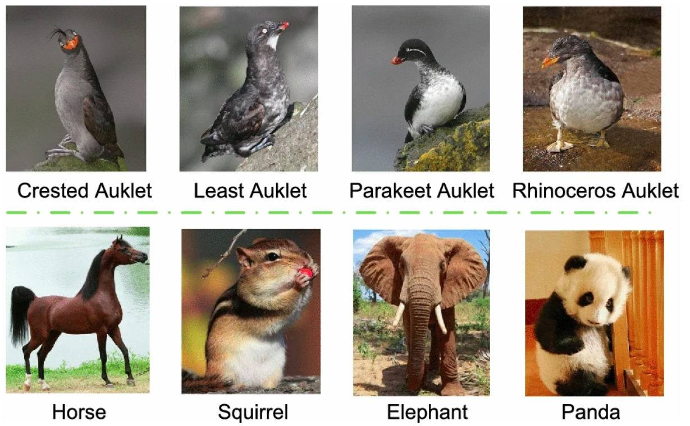

# Fine-Grained Image Classification Project

<h1 align="center">Looking for the Devil in the Details!</h1>
<div>
<a href="https://github.com/unitn-machine-learning/fine-grained-image_classification/network/members"></a>
<a href="https://github.com/unitn-machine-learning/fine-grained-image_classification/pulls"></a>
<a href="https://github.com/unitn-machine-learning/fine-grained-image_classification/issues"></a>
<a href="https://github.com/unitn-machine-learning/fine-grained-image_classification/graphs/contributors"></a>
<a href="https://github.com/unitn-machine-learning/fine-grained-image_classification/blob/main/LICENSE"></a>
</div>


</br>



<p align="center">
[credit](https://link.springer.com/article/10.1007/s13042-021-01473-8/figures/1)
</p>
<br />
<p align="center">
  <h3 align="center">Introduction</h3>

  <p align="left">
    Fine-grained image classification is a challenging task in computer vision that involves distinguishing between very similar categories within a broader class. Unlike general image classification, where the goal is to categorize images into high-level categories (e.g., dogs vs. cats), fine-grained classification requires identifying subtle differences between subcategories (e.g., different breeds of birds).
    <br />
    <br />
    The motivation behind tackling fine-grained image classification stems from its significant potential to enhance various real-world applications. In wildlife monitoring, accurately classifying species can aid in conservation efforts by providing precise data on biodiversity. 
    In the medical field, fine-grained classification can improve diagnostic accuracy by distinguishing between similar-looking diseases. Despite its importance, fine-grained classification remains challenging due to the high intra-class variability and low inter-class variance, making it an intriguing problem for further research and development.
    <br />
    <br />
    This project aims to explore state of the art methods on Fine-Grained Classification and experiment with them on Benchmark and evaluation Datasets.
    <!-- <a href=""><strong>Read More »</strong></a> -->
    <br />
    <br />
  </p>
</p>
<!--  -->


## Table of Contents

* [Main Folder](#Fine-Grained-Image-Classification)

  - [Project Structure](#project-structure)
    * [Model 1](#Model-1)
    * [Model 2](#Model-2)
    * [images](#images)
    * [root folder](#root-folder)
  - [Installation guide](#installation-guide)
  - [Getting Started](#getting-started)
    * [Prerequests](*prerequests)
    * [Installations](*installations)


## Project Structure


### images:

- `images/` the folder where all snapshot for the training and testing logs are stored.


### root folder

- `environment.yaml`: anaconda environment file, to load the environment.
- `setup.py`: a configuration file for installing the scripts as a package.
- `README.md`: Markdown text with a brief explanation of the project and the repository structure.


## Installation guide

```bash
git clone https://github.com/unitn-machine-learning/fine-grained-image_classification.git
cd text-to-speech-data-collection
sudo python3 setup.py install
```


<!-- GETTING STARTED -->
## Getting Started

## Articles
- [Medium Article](https://medium.com/dev-genius/data-engineering-text-to-speech-data-collection-with-kafka-airflow-and-spark-8745cb8d43f7)

### Prerequisites

Make sure you have the following components installed on your local machine.
* Docker
* DockerCompose
  
### Installation

1. Clone the repo
```bash
git clone https://github.com/unitn-machine-learning/fine-grained-image_classification.git
   ```
 Run
   ```bash
    sudo python3 setup.py install
   ```


<!-- LICENSE -->
## License

Distributed under the MIT License. See `LICENSE` for more information.


<!-- CONTACT -->
## Participants 


👤 **Alberto Gabriele Scuderi**

- GitHub: [Alberto Gabriele Scuderi](https://github.com/)
- Email: [Alberto Gabriele Scuderi](alberto.scuderi@studenti.unitn.it)


👤 **Hafiz Muhammad Ahmed**

- GitHub: [Hafiz Muhammad Ahmed](https://github.com/)
- Email: [Hafiz Muhammad Ahmed](hafizmuhammad.ahmed@studenti.unitn.it)


👤 **Julius Heiko Schmidt**

- GitHub: [Julius Heiko Schmidt](https://github.com/)
- Email: [Julius Heiko Schmidt](juliusheiko.schmidt@studenti.unitn.it)

👤 **Yishak Tadele**

- GitHub: [Yishak Tadele](https://github.com/isaaclucky)
- Email: [Yishak Tadele](yishaktadele.nigatu@studenti.unitn.it)
- LinkedIn: [Yishak Tadele](https://www.linkedin.com/in/yishak-tadele/)


## Show US your support

Give US a ⭐ if you like this project!
